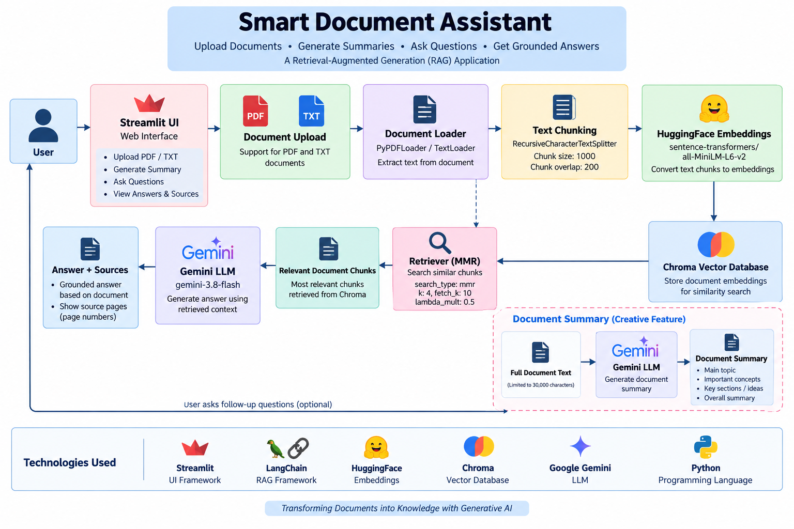

# Smart Document Assistant

A Retrieval-Augmented Generation (RAG) application that allows users to
upload PDF and TXT documents, ask questions about their content, and
receive answers grounded in the uploaded document.

The application also provides document summaries and displays the source
pages used to generate an answer.

---

## 1. Problem Statement

Finding specific information inside large documents can be time-consuming.

The Smart Document Assistant solves this problem by allowing users to
upload documents and ask questions in natural language.

The application retrieves relevant sections from the uploaded document
and uses a Large Language Model to generate an answer based only on the
retrieved document context.

---

## 2. Features

- Upload PDF documents
- Upload TXT documents
- Extract document text
- Split documents into smaller chunks
- Generate embeddings using HuggingFace
- Store embeddings in Chroma vector database
- Retrieve relevant document chunks using MMR
- Answer questions using Google Gemini
- Ground answers using retrieved document context
- Display source pages for answers
- Generate an automatic document summary
- Simple Streamlit user interface

---

## 3. Architecture

The application follows a Retrieval-Augmented Generation (RAG)
architecture.

### Document Processing

1. User uploads a PDF or TXT document.
2. The appropriate document loader extracts the text.
3. The extracted text is divided into smaller chunks.
4. HuggingFace generates embeddings for the chunks.
5. The embeddings are stored in Chroma.

### Question Answering

1. User enters a question.
2. The retriever searches the Chroma vector database.
3. Relevant document chunks are retrieved.
4. The retrieved chunks are provided as context to Gemini.
5. Gemini generates an answer using the provided context.
6. The application displays the answer and source pages.

### Document Summary

The application can also generate an automatic summary of the
uploaded document using Gemini.



---

## 4. Technology Stack

### Programming Language

- Python

### User Interface

- Streamlit

### RAG Framework

- LangChain

### Document Processing

- PyPDF
- LangChain Text Splitters

### Embeddings

- HuggingFace
- sentence-transformers/all-MiniLM-L6-v2

### Vector Database

- Chroma

### Large Language Model

- Google Gemini

### Environment Management

- python-dotenv

---

## 5. How RAG Works

The application uses Retrieval-Augmented Generation.

Instead of directly asking the language model to answer a question,
the application first searches the uploaded document for relevant
information.

The retrieved information is then passed to Gemini as context.

The process is:

User Question
       ↓
Retriever
       ↓
Relevant Document Chunks
       ↓
Gemini
       ↓
Grounded Answer

This helps the application answer questions using information from the
uploaded document.

---

## 6. Hallucination Handling

The application instructs Gemini to use only the retrieved document
context when answering questions.

If the required information is not available in the retrieved context,
the application instructs the model to respond:

"I could not find the answer in the document."

This reduces the possibility of generating information that is not
supported by the uploaded document.

---

## 7. Creative Feature

### Automatic Document Summary

The application provides an automatic document summary feature.

After processing the uploaded document, the user can generate a summary
containing:

- Main topic
- Important concepts
- Important sections or ideas
- Overall summary

The summary is generated using Google Gemini based on the document
content.

---

## 8. Source Display

For question answering, the application displays the source page numbers
associated with the retrieved document chunks.

This allows users to identify where the information used for the answer
came from and verify the answer against the original document.

---

## 9. Project Structure

```text
Smart-Document-Assistant/
│
├── app.py
├── create_database.py
├── requirements.txt
├── README.md
├── architecture.png
├── .gitignore
├── .env
└── chroma_db/